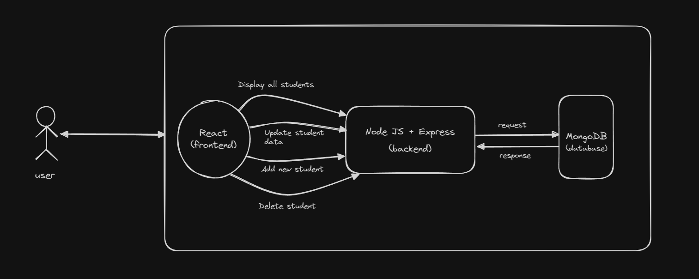

# My Project

This is a sample project to demonstrate how to include images in a README file.

## Features

- Feature 1
- Feature 2
- Feature 3

## Screenshots

Basic flow of Operations:

## Installation

Instructions for installing the project.

## Usage

Instructions for using the project.

## Contributing

Guidelines for contributing to the project.

## License

This project is licensed under the MIT License.